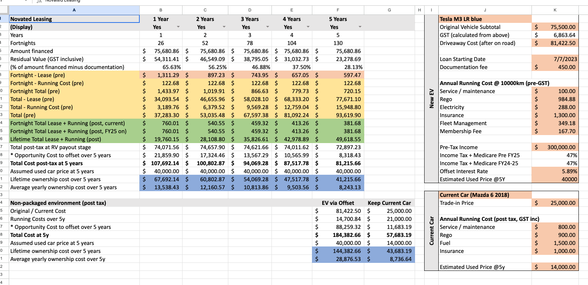
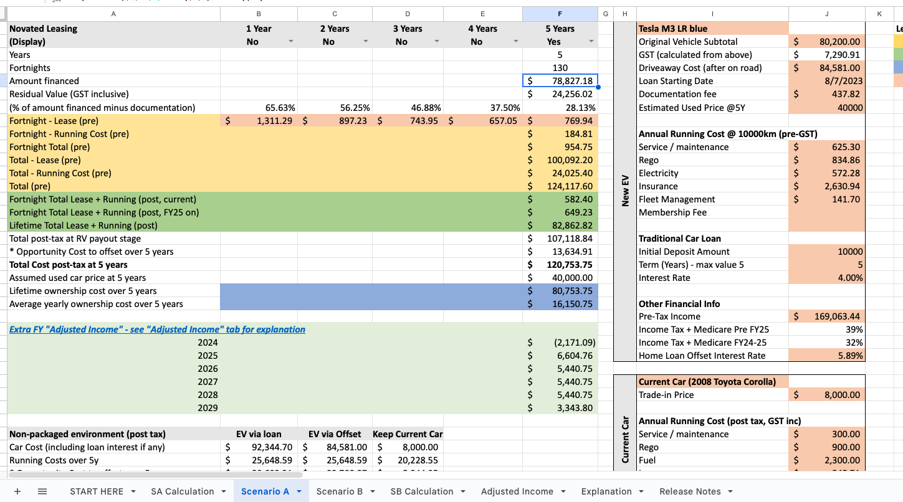
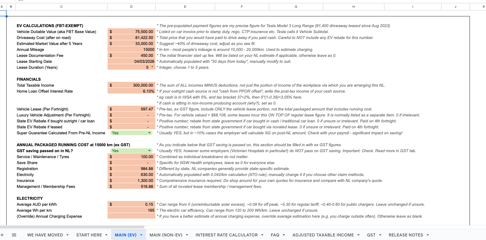
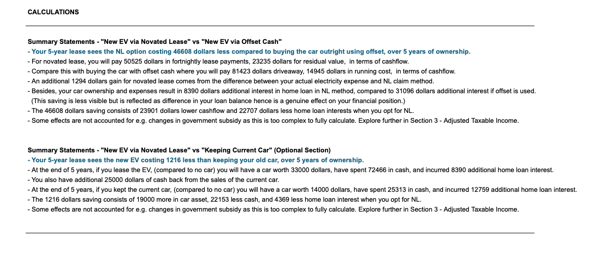
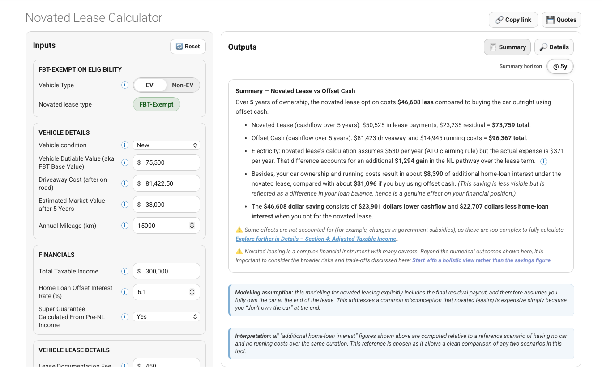

# History of the novated lease calculator

This calculator did not start as a web application. It began as a personal spreadsheet to answer a very specific and personal question: *Does novated lease work out for me?*

Over time, the model evolved through several distinct phases, each addressing shortcomings or misconceptions observed in the previous version. It was also released to the public at the encouragement of early users who found it helpful. 

---

## Early 2023: manual spreadsheet and rough opportunity cost concepts

{width=80%}

The earliest version of the calculator was a heavily manual spreadsheet. Many inputs were typed in by hand, and I manually compared 1, 2, 3, 4 and 5-year lease by listing them on five columns. It was also EV only as this was what I was looking into. 

At this stage, the concept of *opportunity cost* was introduced to explain an often-overlooked issue: using cash (or redraw/offset funds) to buy a car has a real financial consequence, even if it does not feel like an explicit payment. The spreadsheet attempted to capture this by estimating foregone interest savings from offset accounts.

However, this early presentation of opportunity cost was nebulous and did not inspire confidence. 

---

## Mid 2023: Second iteration: recognising Adjusted Taxable Income

{width=80%}

The second major evolution came with the recognition that EV novated leases can *increase* Adjusted Taxable Income (ATI), even when they reduce headline taxable income. This is a subtle but important adverse effect that is rarely discussed, and was largely unknown to many users at the time, often only becoming apparent later through higher HECS repayments or reduced childcare subsidy.

This version explicitly modelled ATI and highlighted downstream consequences for means-tested systems such as:

- childcare subsidy
- HECS/HELP repayments
- Medicare levy surcharge

By separating taxable income from ATI, the spreadsheet began to show that novated leases are not universally beneficial, and that their impact depends heavily on a household’s broader financial context.

---

## Early 2024: Third iteration: full rewrite with asset, liability, and cashflow simulation

{width=80%}

The next major step was a complete rewrite of the spreadsheet from first principles. Instead of relying on adjustments and heuristics, the model was restructured to explicitly track:

- cashflow (pre-tax and post-tax)
- assets (vehicle value over time)
- liabilities (including home loan balances and the interest effects of changes in offset account usage)

This allowed genuine *apples-to-apples* comparisons between pathways, such as:

- EV via novated lease
- EV via traditional car loan or cash
- keeping an existing vehicle

I also included a layman friendly "summary" for those who connect better with written sentences than tables. 

{width=80%}

Later evolution also introduced a separate worksheet for **non-EV vehicles**, where Fringe Benefits Tax (FBT) applies. This made it possible to model FBT-applicable scenarios alongside FBT-exempt EVs.

Additional features over time: 

- explicit warnings about the impact of novated leasing on superannuation (for employer who choose to calculate super guarantee on post-NL income)
- the ATO 4.2c/km electricity claim method
- scenarios where GST savings are *not* passed on by employers or salary packaging providers
- back-calculation of effective interest rate from fortnightly lease figure
- year-by-year (financial year) breakdowns, particularly relevant for users close to marginal tax bracket thresholds

At this point, the spreadsheet had become a comprehensive financial simulator rather than a simple calculator. With this it received increasing mention in Reddit, Facebook and Whirlpool discussions. 

---

## Early 2026: Transition to a web-based calculator and accompanying guide 

{width=80%}

The spreadsheet had become increasingly powerful, but also increasingly clunky. Users needed to make their own local copies to experiment with scenarios, and there was always a risk of accidentally breaking formulas. It became clear that, if the calculator was to be widely usable and robust, it needed to become an application rather than a spreadsheet.

Developing the calculator as a financial web application turned out to be an unexpectedly educational experience. In hindsight, it was fortunate that the entire model had first been built and stress-tested as a spreadsheet. Every formula was auditable, and over nearly three years of public use, many small bugs and edge cases were identified through informal peer review in online discussions. As a result, the spreadsheet became — and remains — the *gold standard* reference for the underlying mathematics.

For a long time, building a web application felt out of reach. While I had some familiarity with basic Python and statistical software, I was never a self-sufficient programmer. Reading code was possible; writing it from scratch, including correct syntax and structure, would have required an impractical amount of trial and error. A few volunteers suggested turning the spreadsheet into a web application on my behalf, but these attempts ultimately did not progress.

This roadblock was removed by the emergence of large language models. ChatGPT acted as a force multiplier: from choice of programming language and framework to highly specific implementation details (for example, displaying warnings when users enter values beyond regulatory thresholds), ideas could be translated into working code with remarkable speed. What would previously have taken months of experimentation was condensed into a matter of weeks.

A deliberate design choice was made *not* to simply replicate the spreadsheet in the browser. While transparency and auditability were important, directly mirroring a large spreadsheet would have been both clunky and difficult to maintain. Instead, the entire calculation engine was rewritten from first principles. This involved explicitly coding dozens of foundational rules — such as tax bracket derivations from taxable income, fortnightly lease payment schedules from a given start date, and the construction of financial-year and FBT periods — upon which all higher-level calculations are built.

The existence of a trusted spreadsheet reference proved invaluable during validation. In the final development phase, multiple representative scenarios were constructed and run side-by-side in both the spreadsheet and the web application. Each output was cross-checked until the results matched precisely. While this process required further iteration, achieving exact agreement between two independently implemented models provided strong confidence in the soundness of the underlying mathematics, as well as a great deal of personal satisfaction.

---

## Ongoing philosophy

Throughout its evolution, the guiding principle of the calculator has remained consistent: **compare net outcomes, not marketing figures**.

Rather than advertising tax saving, the calculator aims to show users:

- what cash actually leaves their pocket
- what assets and liabilities they hold 
- how sensitive outcomes are to assumptions such as interest rates, income levels, and impact on subsidy, super etc. 

The web-based version is not an endpoint, but the latest iteration of an ongoing attempt to make novated leasing analysis more transparent and grounded in real financial outcomes.

--8<-- "includes/support-box.md"
--8<-- "includes/keane-box.md"