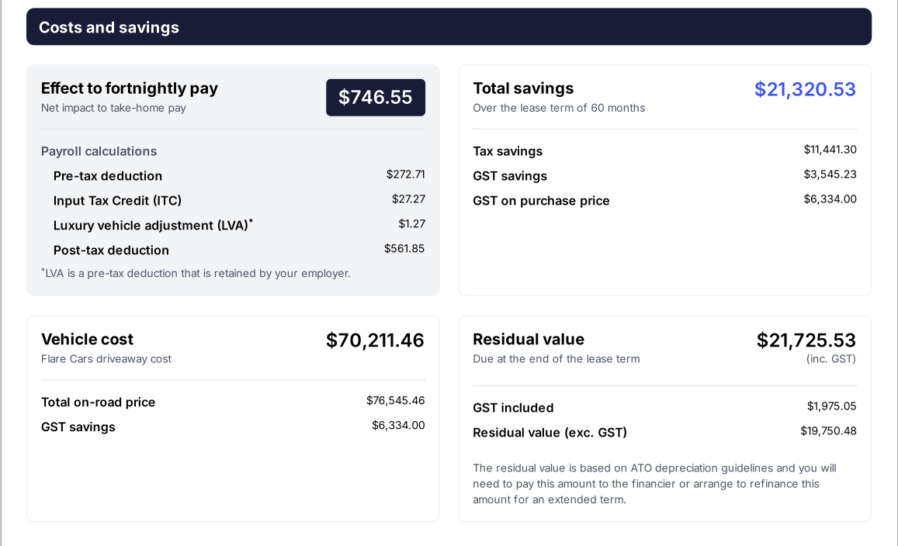
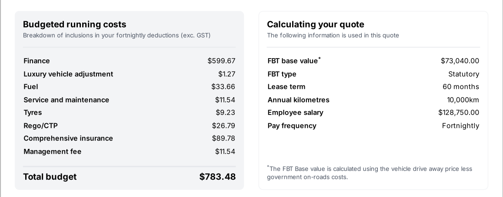
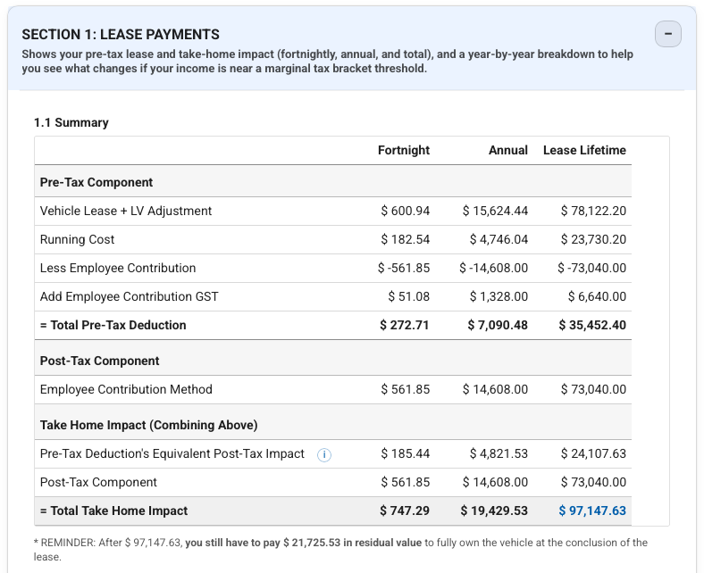
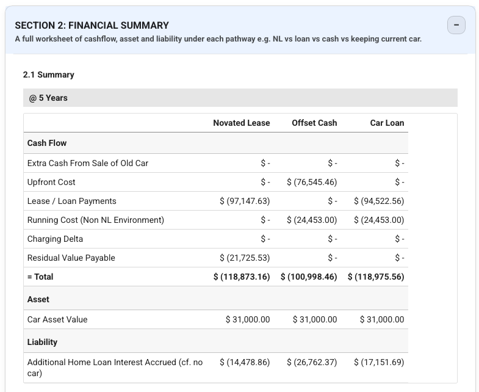
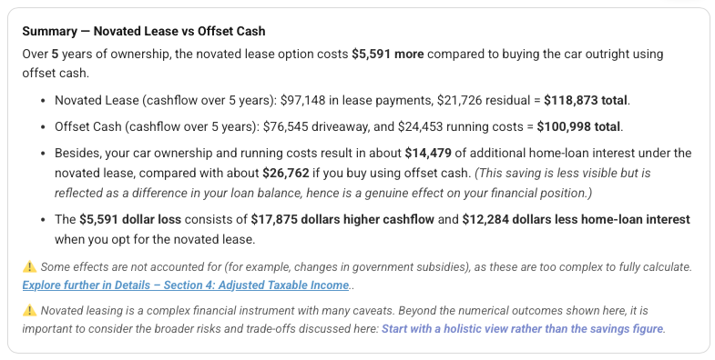
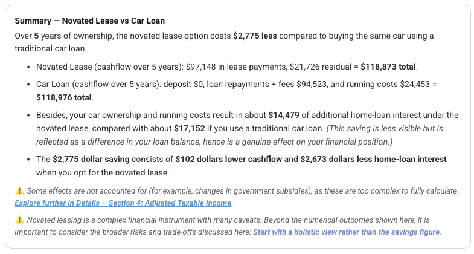

# Real-life example: How a marketed "$21,320 savings" result in a $5,591 net loss

---

## Executive Summary

This example examines a real novated lease offer that **claims a "$21,320.53 savings".** However, when considering all cash flows, tax effects, and opportunity costs, the actual net financial outcome reveals **a loss of approximately $5,591** over five years compared to a cash purchase. This analysis highlights the importance of looking beyond headline "tax savings" and understanding the full financial impact of novated leasing.

This example analyses an FBT‑applicable novated lease. The conclusions should not be generalised to FBT‑exempt EV novated leases. For FBT‑exempt EVs, the magnitude of savings is typically much larger, and net‑outcome analysis more often still favours leasing.

---
## The Original Quote Being Analysed

The screenshots below are taken directly from a real novated lease quote provided to an applicant.

The headline figure highlighted in blue — **“$21,320.53 total savings”** — is the number that will be examined and decomposed in the sections that follow.

{width=80%}
{width=80%}

---
## Context

To evaluate the novated lease offer accurately, we start with the following details:

- **Vehicle:** BYD Sealion 8, a 7-seater plug-in hybrid electric vehicle (PHEV).
- **Lease Type:** FBT-applicable lease (the Fringe Benefits Tax exemption for PHEVs has expired since 1/4/2025).
- **Applicant Income:** $128,750 per annum, placing them in the 30% marginal tax bracket plus a 2% Medicare levy.
- **Financing Context:** The applicant has a principal place of residence (PPOR) home loan with an interest rate of 5.4%. The alternative funding source for purchasing the car outright would be the home loan offset account.
- **Lease Term:** 5 years.
- **Lease Payment:** $599.67 per fortnight, which corresponds to an effective interest rate of approximately 11.48%, which sits at the higher end of typical market rates.
- **Vehicle Price:** On-road price of $76,545.46, with a Fringe Benefits Tax (FBT) base value of $73,040.

---

!!! info "Interactive calculator — audit this example yourself"
    You can open the Novated Lease Calculator with **all figures from this case study pre‑filled** using the link below.  
    This allows you to independently verify every number discussed in this analysis and explore how the outcome changes under different assumptions.

    [Open this example in the Novated Lease Calculator (new tab) →](https://novatedlease.guide/calculator/?c=eyJ2IjoxLCJpbnB1dHMiOnsidmVoaWNsZVR5cGUiOiJOb24tRVYiLCJ2ZWhpY2xlQ29uZGl0aW9uIjoiTmV3IiwidXNlZENhckZpcnN0SGVsZEFmdGVySnVsMjAyMiI6ZmFsc2UsInVzZWRDYXJMY3ROZXZlclBheWFibGUiOmZhbHNlLCJ2ZWhpY2xlQmFzZVZhbHVlIjo3MzA0MCwiZHJpdmVhd2F5Q29zdCI6NzY1NDUuNDYsImVzdGltYXRlZE1hcmtldFZhbHVlQXRFbmQiOjMxMDAwLCJhbm51YWxNaWxlYWdlS20iOjEwMDAwLCJsZWFzZURvY0ZlZSI6MCwibGVhc2VTdGFydERhdGUiOiIyMDI2LTAzLTA3IiwibGVhc2VEdXJhdGlvblllYXJzIjo1LCJtb250aHNEZWZlcnJlZCI6MiwidG90YWxUYXhhYmxlSW5jb21lIjoxMjg3NTAsImhvbWVMb2FuT2Zmc2V0SW50ZXJlc3RSYXRlIjo1LjQsInZlaGljbGVMZWFzZVBlckZuIjo1OTkuNjcsImx1eHVyeVZlaGljbGVBZGpQZXJGbiI6MS4yNywiZmluYW5jZWRBbW91bnRGb3JJbnRlcmVzdENhbGNFeEdzdCI6NzAyMTEuNDYsInN1cGVyRnJvbVByZU5sSW5jb21lIjoiWWVzIiwiZ3N0U2F2aW5nUGFzc2VkT24iOiJZZXMiLCJzZXJ2aWNlTWFpbnRUeXJlc0FubnVhbCI6NTQwLjAyLCJzYXZlU2hhcmVBbm51YWwiOjAsInJlZ2lzdHJhdGlvbkFubnVhbCI6Njk2LjU0LCJlbGVjdHJpY2l0eUFubnVhbCI6NDIwLCJmdWVsQW5udWFsIjo4NzUuMTYsImluc3VyYW5jZUFubnVhbCI6MjMzNC4yOCwibWFuYWdlbWVudEZlZXNBbm51YWwiOjMwMC4wNCwiYXZnQXVkUGVyS3doIjowLjE1LCJhdmdXaFBlckttIjoxNjUsImNvbXBhcmVXaXRoQ2FyTG9hbiI6dHJ1ZSwiY2FyTG9hbkluaXRpYWxEZXBvc2l0IjowLCJjYXJMb2FuSW50ZXJlc3RSYXRlUGN0Ijo4LjI5LCJjYXJMb2FuTW9udGhseUZlZSI6MTUsImNvbXBhcmVXaXRoQ3VycmVudENhciI6ZmFsc2UsImN1cnJlbnRDYXJNYXJrZXRWYWx1ZU5vdyI6MjUwMDAsImN1cnJlbnRDYXJNYXJrZXRWYWx1ZUF0RW5kIjoxNDAwMCwia3VycmVudFNlcnZpY2VNYWludFR5cmVzQW5udWFsIjo4MDAsImN1cnJlbnRSZWdpc3RyYXRpb25Bbm51YWwiOjkwMCwiY3VycmVudEZ1ZWxBbm51YWwiOjIzNjIuNSwiY3VycmVudEluc3VyYW5jZUFubnVhbCI6MTAwMH19){: target="_blank" rel="noopener noreferrer" }

    All inputs are editable — readers are encouraged to adjust assumptions (interest rate, mileage, offset rate, etc.) to test the sensitivity of the net outcome.

## Step 1: Novated Lease Cashflow Analysis

The novated lease structure includes several components:

- Vehicle lease payments
- Luxury vehicle adjustment fees
- Fortnightly running cost budgets (fuel, maintenance, tyres, registration, insurance)

The total fortnightly cost sums to $783.48. Because this is an FBT-applicable lease, it includes a post-tax employee contribution of $561.85 per fortnight. After adjusting for GST on the employee contribution, the remaining $272.71 is paid from pre-tax income. 

Calculating the net take-home impact:

- Pre-tax deduction after tax (30% + 2% Medicare levy): $272.71 × 68% = $185.44
- Total take-home impact per fortnight: $561.85 + $185.44 = $747.29

> *Note:* There is a minor discrepancy of $0.74 per fortnight compared to the original quote, possibly due to rounding or calculation errors in the quote.

Over 5 years, the applicant pays:

- Out-of-pocket lease payments: $747.29 × 130 = $97,147.63 *(minor discrepancy due to rounding)*
- Residual value owed at lease end: $21,725.53

**Total cash outflow for novated lease pathway:**  
$97,147.63 (lease payments) + $21,725.53 (residual) = **$118,873.16**, inclusive of running costs and residual.

{width=80%}

---

## Step 2: Cash Purchase Cashflow Analysis

For comparison, consider purchasing the vehicle outright with cash from the home loan offset account.

- Vehicle purchase price (drive-away): $76,545.46
- Running costs include fuel, service, maintenance, tyres, registration, and comprehensive insurance.

The running cost budget per fortnight (ex-GST) is:  
Fuel $33.66 + Service $11.54 + Tyres $9.23 + Registration $26.79 + Insurance $89.78 = $170.99

Adjusting for GST (×1.1) and 130 fortnights (5 years):  
$170.99 × 1.1 × 130 = **$24,453**

**Total cash outflow for cash purchase pathway:**  
$76,545.46 (vehicle) + $24,453 (running costs) = **$100,998.46**

{width=80%}

---

## Step 3: Opportunity Cost via Home Loan Offset

A key factor often missed is the opportunity cost of using offset cash versus leasing.

- Using $76,545.46 from the offset account reduces interest savings on the home loan.
- For example, at 5.4% interest, this results in approximately $4,000 of lost interest savings the first year.

The novated lease calculator simulates the fortnight-by-fortnight interest impact:

| Scenario               | Additional Home Loan Interest |
|-----------------------|-------------------------------|
| Novated lease         | $14,478.86                    |
| Offset cash purchase  | $26,762.37                    |

**Novated lease saves approximately $12,283.51 in home loan interest compared to offset cash purchase.**

---

## Step 4: Net Financial Outcome at 5 Years

{width=80%}

Bringing all components together:

| Item                                | Amount ($)        |
|------------------------------------|-------------------|
| Novated lease total cash outflow   | 118,873.16        |
| Cash purchase total cash outflow   | 100,998.46        |
| Difference (Novated lease - Cash)  | +17,874.70        |
| Home loan interest saved by leasing| -12,283.51        |
| **Net difference (loss)**          | **+5,591.19**     |

This indicates that, despite the advertised "$21,320.53 savings," the novated lease produces a net **$5,591 loss** compared to purchasing the vehicle with cash from the offset account after 5 years.

> **Why "Tax Saved" ≠ "Money Saved":**  
> The quoted "total savings" often reflect tax reductions but omit management fees, higher effective interest rates, luxury vehicle adjustments, and residual value obligations. These factors significantly affect the net financial outcome.

---

## Important Distinction: FBT‑Applicable vs FBT‑Exempt Novated Lease

The misleading “tax savings” problem illustrated in this example is most severe in FBT‑applicable novated leases. These leases incur Fringe Benefits Tax and associated costs, which create a structural drag on the financial benefits and can significantly reduce or even eliminate net savings.

In contrast, FBT‑exempt novated leases for eligible electric vehicles (EVs) remove the largest structural drag — the Fringe Benefits Tax and associated Employee Contribution Method (ECM) costs. This materially changes the economics of the lease, often resulting in a much more favourable financial outcome.

While net‑outcome analysis remains important for all novated leases, genuine savings of a much larger magnitude are commonly observed for FBT‑exempt EV novated leases. These savings more reliably translate into positive net benefits for the lessee compared to FBT‑applicable leases.

---

## Additional Comparison: Novated Lease vs Car Loan

{width=80%}

If cash is not available and the alternative is a car loan:

- Assumed car loan rate: 8.29% with $15 monthly fees (reflecting a less favourable loan).
- Under these conditions, the novated lease shows a net advantage of approximately **$2,775** over 5 years compared to the car loan.

While novated leasing may be financially preferable to some loan options, the true difference is far less than the touted "$21,320.53 total savings."

> **Other caveats:**  
> Beyond the numerical comparison shown here, novated leases carry a range of structural risks and trade-offs — including early termination risk — that are discussed in detail elsewhere. These broader considerations may materially affect whether a novated lease is appropriate for a given individual, regardless of whether it appears marginally favourable on paper.  
>  
> For a more complete discussion, see: [Is novated lease right for me?](../start-here/is-it-worth-it.md)
---

## Summary of Comparisons

| Comparison               | Net Outcome Over 5 Years             |
|-------------------------|------------------------------------|
| Novated Lease vs Offset Cash Purchase | Novated lease results in **$5,591 loss** |
| Novated Lease vs Car Loan             | Novated lease results in **$2,775 gain**  |

---

## Key Takeaways

- The advertised "total savings" in novated lease quotes often represent tax savings only and do not reflect the full financial picture.
- Opportunity costs related to home loan interest are important to consider.
- Novated leasing may be financially beneficial compared to some car loans but usually not as advantageous as headline savings suggest.
- Early termination risks and other caveats can impact the overall utility of a novated lease.
- Always evaluate the **net financial outcome** rather than relying on partial or tax-focused savings figures.
- The conclusions in this article primarily apply to FBT‑applicable novated leases and should not be misread as a blanket criticism of FBT‑exempt EV novated leasing.

---

!!! info "Support this independent calculator & guide"
    This site is provided free as an independent, unbiased educational resource — something surprisingly rare in the novated-lease space.

    If it has helped you make a more informed decision, find a better deal or avoid a costly mistake, consider supporting its continued development:

    - [Using my Tesla referral link](https://ts.la/chang705436) for a $350 discount if you’re ordering a Tesla, or  
    - [Buying me a cuppa](https://buymeacoffee.com/changyang1230) ☕ to help cover hosting, development time, and future improvements. 