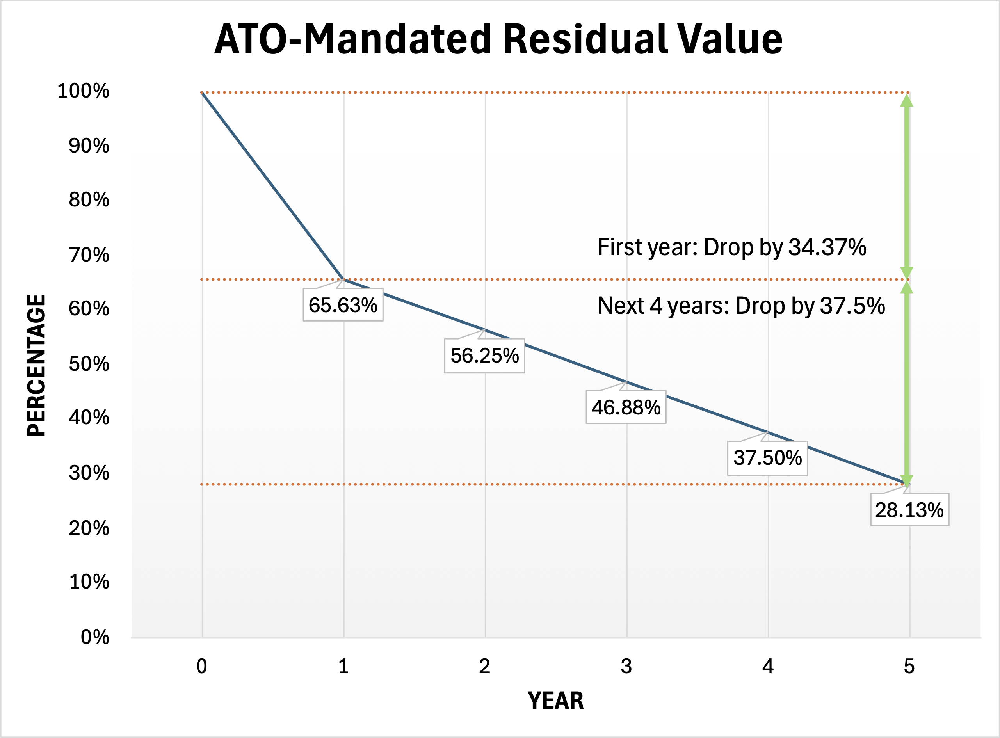

# All about residual values

Residual value is one of the **most important variables** in a novated lease, and misunderstanding it is a major reason people misjudge whether a lease is good value.

Unfortunately, some novated lease providers do not adequately explain residual values to first‑time lessees. As a result, some people are surprised to discover that they still owe tens of thousands of dollars at the end of the lease if they wish to keep the vehicle.

---

## What a residual value actually is

In a novated lease, the residual value (sometimes called a balloon payment) is the **amount you still owe at the end of the lease term** if you want to keep the vehicle.

It is not optional.

At the end of the lease, you must either:

- pay the residual and keep the car, or  
- refinance the residual into a new lease or loan, or  
- sell the car (or return it via the provider) and use the proceeds to clear the residual.  

Regardless of which path you take, the residual is a **real financial liability** that does not disappear.

---

## Residual value is deferred payment, not savings

A common psychological mistake is to treat the residual as a distant problem:

> “I’ll worry about that later.”

From a financial perspective, this is incorrect.

A novated lease simply divides the cost of the car into:

- amounts paid during the lease term, and  
- a large lump sum paid at the end.

Ignoring the residual is equivalent to ignoring part of the purchase price.

This is exactly why residual values must be included when assessing whether a novated lease makes sense overall. You can see how residual values form part of the **net financial outcome** when you model realistic scenarios in the [novated lease calculator](../calculator/index.md).

---

## Market value ≠ residual value

Another common misconception is that the residual reflects the *expected* future market value of the car.

It does not.

The residual is an **accounting construct**, not a valuation estimate or guarantee.

As a result, the car’s market value and the end‑of‑lease residual value are **independent variables**. When evaluating the total financial outcome of a novated lease, both must be considered separately. 

---

## The ATO’s intent behind residual values

Many people understand *what* the residual or balloon payment is, but struggle to understand **why it exists at all**.

The answer is simple: **because the ATO requires it**.

The concept of a mandatory minimum residual value was introduced by the ATO decades ago, first in **[IT 28 (1960)][it28]** and later clarified in **[TD 93/142][td93142]** (with subsequent addenda).

You *can* read those rulings directly, but they are dense, technical, and heavy on legal terminology.

The short version is this:

> Residual values exist to ensure that leases are **genuine leases**, not disguised loans.

From the ATO’s perspective, a lease is meant to be meaningfully different from a loan.

If leases were allowed to run down the value of an asset to a token amount (for example, claiming that a car is “worth $50” after a two‑year lease), they would effectively become **fully tax‑deductible loans in disguise**.

To prevent this, the ATO enforces minimum residual values that:

- assume the asset still has **some remaining economic value** at the end of the lease, and  
- very coarsely correspond to real‑world depreciation over time.

In other words, residual values exist to **protect the tax system from abuse**. They ensure that lease payments broadly reflect depreciation of the asset rather than its full cost.

---

## Residual values table

{width=50%}

Residual values are not set at random.

They are constrained by **ATO minimum residual guidelines**, which specify the *lowest* residual value permitted for a given lease term.

In particular:

- 1 year lease → 65.63% residual  
- 2 year lease → 56.25% residual  
- 3 year lease → 46.88% residual  
- 4 year lease → 37.50% residual  
- 5 year lease → 28.13% residual  

Providers may set residuals **above** these minimums, but they cannot set them below.

---

### How was residual value derived?

At first glance, the ATO residual table can look like a random list of percentages across 1 to 5 years.

It isn’t.

There is explicit mathematics behind these numbers, laid out in **TD 93/142**.

The underlying assumption is that:

- the car is assumed to start at **75% of cost at year 0**, and  
- its effective life is assumed to be **8 years**,  
- therefore its value is assumed to decline **linearly** by one‑eighth of 75% each year.

Mathematically:

- 75% ÷ 8 = **9.375% per year**

This explains the residual table directly:

- Year 1: 75 − 1 × 9.375 = **65.63%**  
- Year 2: 75 − 2 × 9.375 = **56.25%**  
- Year 3: 75 − 3 × 9.375 = **46.88%**  

…eventually reaching 0% at year 8.

This derivation is explicitly described in TD 93/142 using the formula:

> **Minimum residual value as a percentage of cost = 75% − [(75% ÷ 8) × duration in years]**

Although the published table uses whole years, it is derived from a **linear equation**.

---

### How is the residual defined for 13‑month or other non‑integer lease durations?

The complication arises with **non‑integer lease terms**, such as 13 months or 18 months.

The ATO does **not** publish worked examples showing how to apply the residual formula to fractional years. This lack of explicit guidance has led to a range of creative and sometimes questionable approaches in the industry.

The most common approach is:

> **rounding up** a 13‑month lease to 2 years  
> and applying the 2‑year residual value.

By doing this:

- more of the car is paid down using pre‑tax dollars,  
- interest is only accrued for 13 months,  
- running costs that would normally fall into a second year may also be claimed,  
- while the residual is calculated as if the lease ran for 24 months.

From a purely numerical perspective, this can increase savings.

### The mathematically consistent approach

The mathematically consistent way to handle non‑integer terms would be to **apply the formula directly**.

For example, for a 1.5‑year lease:

> Minimum residual value  
> = 75 − 1.5 × 9.375  
> = **60.94%**

### The risk trade‑off of using next‑integer‑year residual values

Some novated lease providers and financiers still choose to use the **“round up to the next year”** approach.

If they do so, you may indeed derive **greater tax savings**.

However, this sits on **murkier legal ground**.

The further the applied residual deviates from what the underlying ATO model implies, the greater the risk that the arrangement could be challenged as **not being a genuine lease** if the ATO were to scrutinise it more closely. 

In other words:

> **Higher savings may come with higher compliance risk.**

---

## How residual values work when a lease is extended

A common misunderstanding is how residual values behave when a novated lease is extended (for example, 1 + 1 + 1 years).

When you extend a lease, the car’s residual value does **not** compound on itself.

In other words, it does **not** become:

> 65.63% of 65.63% of 65.63%

Instead, the residual continues to follow the **original ATO residual table**, calculated as a percentage of the **original vehicle value**.

For example:

- end of year 1 → ~65.63% of original value  
- end of year 2 → ~56.25% of original value  
- end of year 3 → ~46.88% of original value  

This is true even if the lease is structured as consecutive extensions rather than a single multi‑year lease.

The ATO made this explicit in **TD 93/142**, including worked examples (see Example 3). This clarification around lease extensions was reinforced in the 2021 addendum.

<https://www.ato.gov.au/law/view/document?docid=TXD/TD93142/NAT/ATO/00001>

It is worth noting that **some novated lease providers and financiers still apply a “repeated 65.63%” style calculation** when leases are extended (i.e. compounding the residual on the prior residual rather than referencing the original vehicle value).

This approach sits in a **legally murky and risky area**, and risks the lease no longer meeting the ATO’s definition of a genuine lease.

---

## Key takeaway

If you remember nothing else:

> **Residual values are an ATO‑enforced constraint designed to prevent leases from becoming tax‑deductible loans. Understanding the legislation becomes particularly important if you are considering non-standard arrangements, such as lease extensions or non-integer-year lease terms.**

They represent **deferred payment** for part of the car’s cost that was never eligible for tax savings.

[td93142]: https://www.ato.gov.au/law/view/document?LocID=%22TXD%2FTD93142%2FNAT%2FATO%22&PiT=99991231235958  
[it28]: https://www.ato.gov.au/law/view/document?DocID=ITR/IT28/NAT/ATO/00001

--8<-- "includes/support-box.md"
--8<-- "includes/keane-box.md"