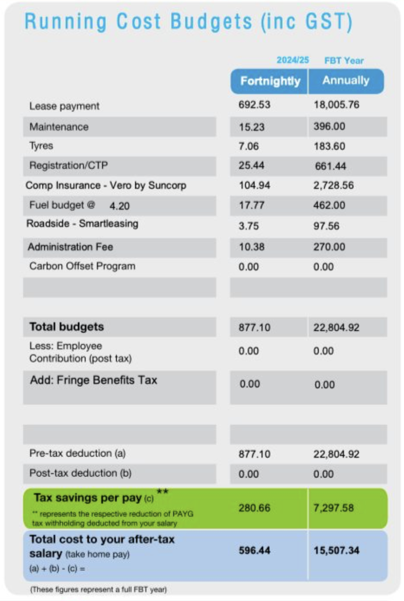
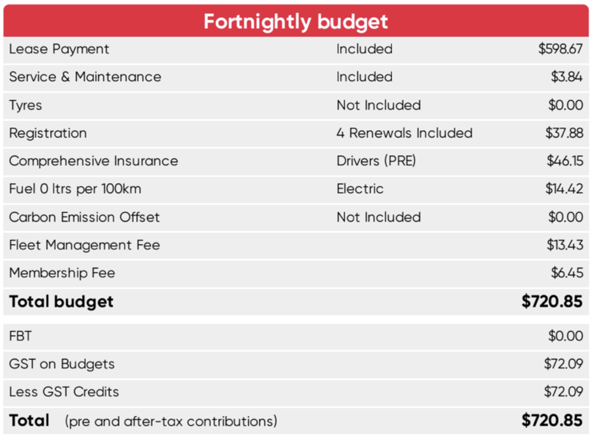

# Failure to pass on GST savings — an overlooked cost in some novated leases

In Australia, most goods and services attract a **10% Goods and Services Tax (GST)**.

For example:

- you pay **$110** for an item,
    - **$100** is the base price,
    - **$10** is GST.

Under a *typical* novated lease arrangement, this GST should **not be a real cost to you**.

But that assumption is not universally true.

---

## How GST savings normally work in a novated lease

Under most novated lease arrangements:

- your employer can claim **input tax credits (ITC)** for the GST incurred on running costs such as:
    - fuel,
    - insurance,
    - servicing,
    - maintenance,
- those GST credits are then **passed on to you**, meaning:
    - you effectively pay only the *GST-exclusive* amount
    - funded using **pre-tax income**.

### Example: when GST savings *are* passed on

Suppose you pay **$11** for a car wash:

- $10 base cost  
- $1 GST  

If your employer passes on the GST credit:

- you effectively only pay the **$10 base cost**,
- funded using pre-tax income.

If you are on the **top marginal tax bracket (45% + 2% Medicare levy)**:

- take-home impact = $10 × (1 − 47%) = **$5.30**

The GST component has effectively disappeared.

This is how novated leases are *usually* expected to work.

---

## What happens when GST savings are **not** passed on

Some employers choose **not to pass on** the GST input tax credit.

In effect:

- the employer may still claim the GST credit from ATO, **but keeps it**, and
- you pay the **full GST-inclusive amount**, even though it is funded pre-tax.

Using the same $11 car wash example:

- you now pay the full **$11** using pre-tax income,
- at the top tax bracket:
  - take-home impact = $11 × (1 − 47%) = **$5.83**

That is a **10% increase in effective cost**, purely because the GST credit was not passed on.

---

## Why this matters

Failing to pass on GST credits means:

- **all running costs become 10% more expensive** than they should be,
- every fuel fill, service, tyre replacement, and insurance premium is affected,
- the cumulative impact over a multi-year lease can be material.

This erodes the “savings” people expect from novated leasing.

---

## Where this is most commonly seen

Anecdotally, this practice appears **disproportionately common in some Victorian public hospitals**.

That does *not* mean it is universal, but it is common enough to warrant explicit checking.

Many employees assume GST savings are automatic, but they are not.

---

## How to tell if GST savings are being passed on

You can often infer this directly from your novated lease quote.

---

### Example 1: GST savings **not** passed on

{width=50%}

**Red flags include:**

- costs described as **“inc GST”** with no adjustment  
- no line item showing GST refunds or credits  
- no reduction in running-cost figures implying GST removal  

**Numerical tell:**

- marginal tax rate for this person: **32% (30% + 2%)**
- pre-tax deduction: **$22,804.92**
- after-tax cost: **$15,507.34**

$15,507.34 ÷ $22,804.92 ≈ **68%**  
→ income tax only, **no GST benefit derived**

**Conclusion:** GST credits are **not** being passed on.

### Example 2: GST savings **are** passed on

{width=50%}

Green flags include explicit GST itemisation and a matching credit.

For example:

- the quote itemises GST explicitly: **$72.09 GST** on a subtotal of **$720.85**,
- it then immediately deducts **“less GST credits”** of **$72.09**,
- the total remains **$720.85**, confirming that figures are calculated exclusive of GST and the credit is returned to the employee.

**Conclusion:** GST credits *are* being passed on.

---

## Why employers do this

From the employer’s perspective:

- it reduces the administrative complexity,
- it may quietly produce a financial gain,
- or is simply “how it’s always been done”.

From the employee’s perspective:

- it is a **real lost benefit**,
- and one that is rarely highlighted or explained.

---

## The key takeaway

If you remember nothing else:

> **A novated lease only saves GST if your employer actually passes the GST credit on to you.**

Do not assume this happens automatically.

Check your quote. A 10% leakage on running costs can quietly undo a meaningful chunk of the benefit you thought you were getting.

---

!!! info "Optional Support"
    Both this guide and the spreadsheet are free. If they prove helpful, consider:

    - [Using my Tesla referral link](https://ts.la/chang705436) for a $350 discount if you’re ordering a Tesla, or  
    - [Buying me a cuppa](https://buymeacoffee.com/changyang1230) ☕ at BuyMeACoffee.com